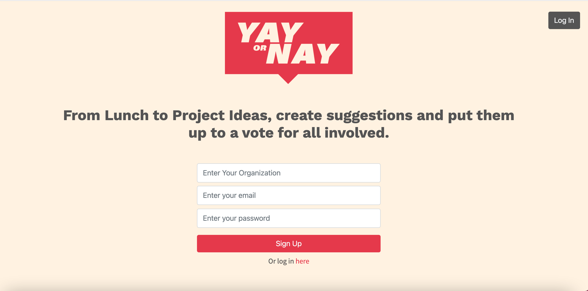

# Yay or Nay

## User Story

*As a team within a company 					                  We want to be able to survey and vote on group decisions for activities or department decisions 					                  So we can organize and plan better.

## Description

Create an app that will allow you to put topics up for a vote within an organization or just a department, without having to send everyone external links to polls etc.

## Technologies Used

* bcryptjs
* dotenv
* ejs
* express
* express-session
* mysql2
* passport
* passport-local
* sequelize
* heroku

## Contributors

* David Rojo
* Trevor Smith
* Stephen Price
* Richard Gabaree

## Links

![GitHub Link] (https://github.com/RojoRevolution/p2_org_decider)

!{Project Link} (

## License

MIT

Copyright (c) 2021

Permission is hereby granted, free of charge, to any person obtaining a copy
of this software and associated documentation files (the "Software"), to deal
in the Software without restriction, including without limitation the rights
to use, copy, modify, merge, publish, distribute, sublicense, and/or sell
copies of the Software, and to permit persons to whom the Software is
furnished to do so, subject to the following conditions:

The above copyright notice and this permission notice shall be included in all
copies or substantial portions of the Software.

THE SOFTWARE IS PROVIDED "AS IS", WITHOUT WARRANTY OF ANY KIND, EXPRESS OR
IMPLIED, INCLUDING BUT NOT LIMITED TO THE WARRANTIES OF MERCHANTABILITY,
FITNESS FOR A PARTICULAR PURPOSE AND NONINFRINGEMENT. IN NO EVENT SHALL THE
AUTHORS OR COPYRIGHT HOLDERS BE LIABLE FOR ANY CLAIM, DAMAGES OR OTHER
LIABILITY, WHETHER IN AN ACTION OF CONTRACT, TORT OR OTHERWISE, ARISING FROM,
OUT OF OR IN CONNECTION WITH THE SOFTWARE OR THE USE OR OTHER DEALINGS IN THE
SOFTWARE.
